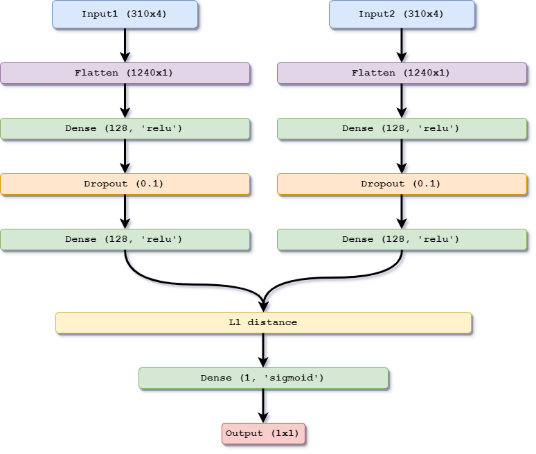

# Maternal Genealogy Lineage Analyzer, version 2.0

[](https://www.gnu.org/licenses/gpl-3.0)

## Introduction

Maternal Genealogy Lineage Analyzer (Magellan), v2.0 is a Python software for the analysis of haplotype heritage in pedigrees for the purpose of quantitative genetic studies. The new version offers a graphical user interface (GUI) for a simpler user experience, as well as an integrated and customizable command line interface (CLI) for memory and CPU intensive tasks.

The software can be executed on macOS, Linux and Windows.

MaGelLAn v2.0 is licenced under GNU General Public License v3.0. It is an open source software and it is free for non-commercial use, as long as it is properly referenced. The authors are Vladimir Brajkovic, Ino Curik, Dalibor Hrsak and Strahil Ristov. Please report any bugs and issues to: [dalibor.hrsak@irb.hr](mailto:dalibor.hrsak@irb.hr).

## References

1. MaGelLAn 1.0: A software to facilitate quantitative and population genetic analysis of maternal inheritance combining molecular and pedigree information;
S. Ristov, V. Brajković, V. Cubric Curik, I. Michieli, I. Curik,  
Genetics Selection Evolution. 2016, 48:65  
DOI: 10.1186/s12711-016-0242-9  
URL: <http://www.gsejournal.org/content/48/1/65>

2. A Fast Method for the Selection of Samples in Populations with Available Genealogical Data;
D. Hrsak, I. Katanic, S. Ristov,
Diversity 2022, 14(2)
DOI: 10.3390/d14020150
URL: https://www.mdpi.com/1424-2818/14/2/150

3. Update on Magellan, the software for the analysis of a single gender lineage in pedigrees;
D. Hrsak, V. Brajkovic, V. Cubric-Curik, I. Curik and S. Ristov,
2022 International Conference on Electrical, Computer and Energy Technologies (ICECET), Prague, Czech Republic
DOI: 10.1109/ICECET55527.2022.9872932
URL: https://ieeexplore.ieee.org/abstract/document/9872932

## Installation

### Downloading the source code
The Magellan2.0 software can be downloaded from Github:
```
git clone git@github.com:sristov/magellan.git
```
and ready for usage if all the requirements are properly installed (*vide infra*). We also recommend adding Magellan to your $PATH, in order to be able to run the software from any location in your system:

```
export MAGELLAN=/path/to/magellan
export $PATH=$PATH:$MAGELLAN
```

### Requirements

Magellan2.0 requires a set of non-native Python packages listed in the *requirements.yml* file.

For best performance we recommend installing the packages using [Miniconda](https://docs.conda.io/en/latest/miniconda.html) package manager, although a simple pip manager should work fine too. After installing a new Miniconda manager on Linux and creating a new clean environment, we have executed the following set of commands to obtain a working version of Magellan 2.0:
```

conda install -c conda-forge tensorflow
conda install -c conda-forge pandas
conda install -c conda-forge dask
pip install pandastable
conda install -c conda-forge r r-essentials
conda install -c conda-forge rpy2
conda install -c conda-forge xgboost

```

The user can also apply the environment file *requirements.yml* by executing the following command in the Magellan source directory:
```
conda env create -f requirements.yml
```

This will create a new conda environment *magellan* with all the dependencies automatically installed. Thereafter, the environment should be activated using:
```
conda activate magellan
```


## Usage

In the new version of Magellan, there are two main modes of executing the code: 1) command line interface (CLI), and 2) graphical user interface (GUI).

### Command line interface

The command line interface (CLI) is best suited for users who need to perform lineage analysis on large pedigrees with >100 000 individuals and/or for users who intend to run the software on HPC clusters.

The Magellan CLI is executed in two obligatory steps:

1) Run the job configuration script *mag_config.py*. This is a dialogue script, where user answers questions about the types of analysis that need to be performed as well as the names of input files, *etc.* The script saves your answers to a JSON file *config.json* in your current working directory.
```
python mag_config.py
```

2) The second step is running the main script *magellan.py* with option `cl`. If *config.json* is not present in your working directory, the program with exit with error and prompt the user to run the *mag_config.py* script first.
```
python magellan.py --mode cl
```

Thereafter, the Magellan main script with execute the software according to the instructions given in `mag_config`. A well versed user can also edit an existing *config.json* file directly using a text editor, instead of running *mag_config.py* multiple times, but caution is advised.

<u>Input format</u>

Magellan accepts the input file containing the pedigree in the CSV (comma-separated values) format. The first line is a header that includes five mandatory keywords:

> **ID**      (name tag of an individual in the pedigree)  
> **father**   
> **mother**  
> **YOB**     (year of birth in single number format)  
> **gender**  (‘1’ for male, ‘2’ for female)  

and two optional keywords:

> **haplotype** (name tag of a haplotype or an SNP sequence; if present, haplotype data enables full
functionality of all modules, however, modules are partially functional
without it)  
>
> **available** (‘1’ for available, anything else for not available; exclusive use in
module *mag_sampl*)  

The place of keywords in the header line must match the column with the corresponding
information in the pedigree file. <u>If a keyword is present but the corresponding column is
missing, the program stops with an error in case of the CL mode.</u>

An example of valid first lines in the input pedigree file is:

```
anything,ID,mother,father,gender,anything,YOB,haplotype,available,anything,
1,Id100,0,0,1,anything,2000,,,anything,
2,Id101,Id102,Id100,2,anything,2005,hap1,1,,
3,Id102,0,0,2,,2001,hap1,0,anything,
```

The same example in a “clean” form (without unused columns and with explicit ‘0’ for non-
available individuals):

```
ID,father,mother,YOB,gender,haplotype,available,
Id100,0,0,2000,1,,0,
Id101,Id100,Id102,2005,2,hap1,1,
Id102,0,0,2001,2,hap1,0,
```

### Graphical user interface

The graphical user interface is intended to be self-explanatory and as user-friendly as possible. It is primarily intended for local usage on stationary computers and laptops for the analysis of pedigrees with a small to moderate number of individuals. Nevertheless, depending on the capabilities of the computer, larger tasks can be assigned to it as well.

The GUI can be invoked in one of the two following ways:

```
python magellan.py --mode gui
python magellan.py
```

The user can thereafter manually setup the options and run the required modules independently. The options in each module and the functionalities are described in the following chapter.

## Modules and functionalities

Here we present an updated version of a typical workflow in Magellan v2.0 with a new pedigree and potential genomic information (created with [Diagrams.net](https://drawio.com)). 

 


### Verification module

This module finds inconsistencies in the female or male haplotype line, depending on what haplotype is given in the pedigree (mitochondrial or Y-chromosome). It calculates haplotype error rates and it performs the verification of a pedigree and lists found errors. The initial search for standard pedigree errors is performed upon loading of the pedigree and, if found, the program reports the errors in ERROR\_ALERT.TXT, before alerting the user and stopping.

Output files are:

**OutputVerif_Summary.txt** - displays the statistics related with pedigree conflicts and HC,
IC and MISPLACED indices

**OutputVerif_ConflictingIndividuals.txt** - lists all conflicting individuals with their
haplotype and number of conflicts

**OutputVerif_DetailedConflictingIndividuals.txt** - lists all conflicting individuals with their
haplotype in more detail

**OutputVerif_MisplacedBranches.txt** - lists haplotyped individuals belonging to misplaced
branches, if the misplaced branches exist in a pedigree

and, optionally:

**OutputVerif_Mutations.txt** - lists individual mutations encountered within a single maternal or paternal line; produced only for SNP sequences in the haplotype column and if the option is activated before execution. <u>Do not</u> activate this option if you have haplogroup names in your pedigree!

If a fatal error is found in your pedigree, the program will also produce the following file:

**ERROR_ALERT.TXT**

This output file reports the encountered fatal errors in the pedigree file. Fatal errors are gender inconsistencies and cycles in the lineage. Year of birth inconsistencies produce  a warning, but the execution continues. Since it is neither possible to calculate the effective population sizes, nor to suggest the proper individuals for sampling if such errors exist in a pedigre, they must be corrected before using other modules.

#### Haplotype imputation submodule

In addition to verifying the consistency of haplotypes accross parental lineages, Magellan offers a possibility of extended verification. It consists of inferring haplotypes of unsequenced individuals based on the haplotype information from sequenced individuals, hereafter referred to as *imputation*. Our software offers two levels of imputation reliability (*high* and *low*), depending on the reliability of the haplotype information. The reliability information is based on the verification algorithm of haplotyped individuals from a single parental lineage. An imputed individual is considered *verified* if it's genetic information has been collected through sampling and available, or if it is a part of a direct familial connection between two sampled individuals with matching haplotypes. An *unverified* imputed individual is an individual whose haplotype has been inferred from a single **verified** (whether sampled or imputed) ancestor. In case of a haplotype incongruity between two sampled individuals of the same parental lineage, only those two individuals will be imputed as *verified*, but no haplotype will be assigned neither to their connecting members nor to their offspring.

The user can choose to apply either a highly or a less reliable level of imputation. At the highly reliable level, the algorithm will impute haplotypes into the pedigree under the **haplotype** column only to *verified* individuals, while at the less reliable level, it will impute haplotype to both *verified* and *unverified* individuals, and it will add a column named **verified** indicating, whether an imputed individual is verified or not. At both levels, the program will also add a column named **sequenced** which indicates whether the individual has been sampled or not.

In case of an example input with the following content:

```
ID,father,mother,YOB,gender,haplotype
1002,0,0,888,1,
1020,0,0,1988,2,
1090,1002,1020,1994,2,
1388,0,0,2005,1,
1615,1388,1090,2008,2,
1654,0,0,2008,1,
2506,1654,1615,2013,1,
2308,1654,1615,2012,2,A
1637,0,0,2008,1,
3123,1637,2308,2015,2,
1286,0,0,2001,1,
1525,1286,1090,2007,2,
1801,0,0,2009,1,
2708,1801,1525,2014,2,G
2043,0,0,2011,1,
3284,2043,2708,2015,1,
1210,0,0,1998,1,
1828,1210,1525,2009,2,
1221,0,0,1998,1,
2191,1221,1828,2011,2,G
2516,1210,2191,2013,1,
3045,2043,1828,2014,1,
2713,2043,1828,2014,2,
3360,1210,2713,2015,2,
```

the algorithm produces the following output pedigree at the high level of reliability:

```
ID,father,mother,YOB,gender,haplotype,sequenced
1002,0,0,888,1,,0
1020,0,0,1988,2,,0
1090,1002,1020,1994,2,,0
1388,0,0,2005,1,,0
1615,1388,1090,2008,2,,0
1654,0,0,2008,1,,0
2506,1654,1615,2013,1,,0
2308,1654,1615,2012,2,A,1
1637,0,0,2008,1,,0
3123,1637,2308,2015,2,,0
1286,0,0,2001,1,,0
1525,1286,1090,2007,2,G,0
1801,0,0,2009,1,,0
2708,1801,1525,2014,2,G,1
2043,0,0,2011,1,,0
3284,2043,2708,2015,1,,0
1210,0,0,1998,1,,0
1828,1210,1525,2009,2,G,0
1221,0,0,1998,1,,0
2191,1221,1828,2011,2,G,1
2516,1210,2191,2013,1,,0
3045,2043,1828,2014,1,,0
2713,2043,1828,2014,2,,0
3360,1210,2713,2015,2,,0
```

, while at the low level of reliability, the output pedigree is the following:

```
ID,father,mother,YOB,gender,haplotype,sequenced,verified
1002,0,0,888,1,,0,0
1020,0,0,1988,2,,0,0
1090,1002,1020,1994,2,,0,0
1388,0,0,2005,1,,0,0
1615,1388,1090,2008,2,,0,0
1654,0,0,2008,1,,0,0
2506,1654,1615,2013,1,,0,0
2308,1654,1615,2012,2,A,1,1
1637,0,0,2008,1,,0,0
3123,1637,2308,2015,2,,0,0
1286,0,0,2001,1,,0,0
1525,1286,1090,2007,2,G,0,1
1801,0,0,2009,1,,0,0
2708,1801,1525,2014,2,G,1,1
2043,0,0,2011,1,,0,0
3284,2043,2708,2015,1,G,0,0
1210,0,0,1998,1,,0,0
1828,1210,1525,2009,2,G,0,1
1221,0,0,1998,1,,0,0
2191,1221,1828,2011,2,G,1,1
2516,1210,2191,2013,1,G,0,0
3045,2043,1828,2014,1,G,0,0
2713,2043,1828,2014,2,G,0,0
3360,1210,2713,2015,2,G,0,0
```
The schematic of the above case is shown in the following image (Brajkovic *et. al.* "Mitogenome information in cattle breeding and conservation genetics: developments and possibilities of the SNP chip for the use of mitogenome information in the near future", manuscript under review): 

 

All individuals with less reliable imputed haplotypes G (3284, 3045, 2713, 3360, 2516) are outlined in the orange , while highly reliable imputed (1525, 1828) or directly genotyped haplotypes (2308, 2708, 2191) are outlined in green.

Moreover, the submodule produces the following output file(s):

**OutputVerif_Imputed.txt** - lists all the imputed individuals

**OutputVerif_ImputedVerified.txt** - lists the imputed verified individuals (produced only in case of the lower reliability level of imputation).

**OutputVerif_ImputedUnVerified.txt** - lists the imputed individuals (produced only in case of the lower reliability level of imputation).

The resulting pedigree with imputed haplotypes can thereafter be saved to a file of a user's choice.

### Statistics module

A bookkeeping module. It outputs various useful distributions of individuals over maternal or paternal pedigree lines. In particular, lists all individuals belonging to a given founder dam/sire line with the corresponding haplotype. It requires an input pedigree without conflicts in maternal or paternal haplotype lines.

Output files are (for paternal lineages file names contain **Sire** instead of **Dam**):

**OutputStat_DamLineMembership_1.txt** - lists the assignment to founder female line for all individuals in a pedigree, effectively imputing the known haplotypes to each individual in pedigree; the format is explicit and easily readable

**OutputStat_DamLineMembership_2.txt** - the same as above, but the format is adjusted to facilitate further processing with spreadsheet programs; less readable

**OutputStat_DamLineMembershipAllInRefPop.txt** – lists the assignment to founder female line for all individuals in reference population; these individuals are included in haplotype line effective population size calculation

**OutputStat_DamLineMembershipFemaleOnlyInRefPop.txt** - lists the assignment to founder female line for only female individuals in reference population; these individuals are included in maternal line effective population size calculation

**OutputStat_DamLinesWithFemalesInRefPop.txt** – lists the details of a female line representation for lines that have female descendants in reference population

**OutputStat_DamLinesWithOnlyMalesInRefPop.txt** - lists the details of a female line representation for lines that have only male descendants in reference population; such lines carry the information about haplotype but are lost in the maternal lineage

### Calculation module

It calculates the effective population size separately for founder dam or sire lines, founder haplotype lines, and founder sire lines. Requires an input pedigree without conflicts in maternal or paternal haplotype lines. A meaningful haplotype line N<sub>e</sub> can be computed only if enough of the individuals are sampled.

Output file is:

**OutputCalc_InputAndResults.txt**

Together with the results of calculations, this file lists the details of pedigree maternal lineage statistics, including all quantities used in the calculations. The information about the number of founder dam lines in reference population with only one sample is important since there is no possibility of verification of the obtained haplotype. Such lines may be treated differently in the further analysis.

### Sampling module

Accepts the optional “available” column with (‘1’ / anything) values. Calculates the target number of the individuals per dam/sire line for sequencing within given planned number of sequencing. Restricts the target numbers to available individuals if *available* data is present. Selects the candidates that provide the highest potential for haplotype diversity within dam line. Requires an input pedigree without conflicts in the maternal or paternal haplotype lines.

There are two sampling algorithms implemented in the software. The default algorithm is *greedy*, as described in Hršak, D.; Katanić, I.;  Ristov, S. A Fast Method for the Selection of Samples in Populations with Available Genealogical Data. *Diversity* **2022**, *14*, 150. <https://doi.org/10.3390/d14020150>. The other algorithm is the *optimal* (also described in the previously mentioned article).


Output files are:

**OutputSampl_IndividualsForSampling.txt** – for each founder dam/sire line lists the selection of individuals for sequencing that would cover the highest diversity in pedigree; if the intended number of sequencings *N* is less than the number of lines only one (***central***) individual is selected from the first *N* lines with the largest representation in reference population; if *available* data is present the choice of individuals is restricted to the available individuals; the percentages of the total population and reference population for each dam line are also being listed here

**OutputSampl_DetailedInfo.txt** – presents the details of calculation; for each dam line lists the number of individuals in the reference population, and the breakdown of the target number of samples in the numbers of the previously sampled and the samplings that remain to be done; the target number per line is obtained from the planned number of samplings as a factor proportional to the line size

and, optionally, if *available* data is present:

**OutputSampl_AvailabilityRestrictions.txt**

This file lists the restrictions imposed if the available number of individuals per line is smaller than the target number. AvailableAllCount includes available and already sampled individuals. AvailableRealCount is the number of available non-sampled individuals. DIFF is the difference between the target number of samplings and the number of available individuals per line. If there are more available individuals than the target number per line, the reamaining number of available individuals is reported.

## Module recode

A small auxiliary module intended for the preparation of the input for lineage visualization using the kinship2 R package. The module is necessary in cases of pedigrees with alphanumeric individual identification marks, whereby it reassigns them new designations containing exclusively numeric symbols. 

Example input:

```
ID,father,mother,YOB,gender,haplotype,available
Id100,0,0,2000,1,,0
Id101,Id100,Id102,2005,2,hap1,1
Id102,0,0,2001,2,hap1,0
```

Produced output:

```
ID,father,mother,YOB,gender,haplotype,available,oldID
101,0,0,2000,1,,0,Id100
102,101,103,2005,2,hap1,1,Id101
103,0,0,2001,2,hap1,0,Id102
```

The mapping of old designations into the new designations is saved to a JSON file named *recoded_ids.json*, and the old designations are also added as a new column in the resulting pedigree, which can be saved to a CSV file. NOTE: Be careful not to overwrite your original pedigree!

## Visualization module

A module with a principal functionality of the extraction of a maternal or a paternal lineage of a pertinent individual. For the paternal line, the selection is restricted to sires only, while for a maternal line it includes male offspring too. By default, the algorithm extracts all the members in the line, from the founder to the last descendants. 

The selection of individuals in the line can be further restricted to a selected span of years of birth, as well as to a certain number of generations before or after the selected individual in the lineage. The input pedigree must contain identification marks containing numeric symbols only, which can be produced using the *recode* module.

The module thereafter activates the *rpy2* interface with the Kinship2 R package (Sinnwell, J. P., Therneau, T. M., & Schaid, D. J. (2014)). The kinship2 R Package for Pedigree Data. *Hum. Hered.*, 91-93.), which then produces a PNG image of the lineage of interest.

NOTE: The *rpy2* interface with the Kinship2 package does not function on Windows! However, the user can extract the lineage, save it in a CSV file and visualize it externally using the Kinship2 (or some other) package directly.

## SNP analysis module

The main purpose of the SNP module is the analysis of inheritance from the point of view of single nucleotide polymorphisms. There are two main functionalities of the module: 1) analysis of the NEOGEN GGP 100K final report, and 2) haplogroup classification of a set of selected SNPs. The former functionality is independent and can be fully performed without a loaded pedigree, while the latter can be pedigree dependent.

The main input file for the module is the NEOGEN final report, which is supposed to have the tab separated values format (TSV) in order to be loaded correctly. An example of a correct input is given below:

```
[Header]
GSGT Version    <version>
Processing Date <date> <time>
Content         GGP_<content>_100K_a1.bpm
Num SNPs    <num>
Total SNPs  <num>
Num Samples     <num>
Total Samples   <num>
[Data]
SNP Name    Sample ID   Allele1 - Forward   Allele2 - Forward   Allele1 - Top   Allele2 - Top   Allele1 - AB  Allele2 - AB    GC Score    X   Y
snp1    sample1 T   G   A   C   A   B   0.6894  0.228   0.318
snp2    sample1 A   C   T   G   A   B   0.4636  0.711   0.548
```

The Header section of the file, along with the [Data] line will be omitted, so their format and content do not matter for the performance, but actual data must be preceded by nine lines for correct reading. The Final report must be accompanied by three auxiliary files: 1) a map file; 2) SNP list; and 3) population list.

The map file is a TSV file containing further information on the SNPs in the array. Below is an example of a correct map file:

```
Index	Name	Chromosome	Position	GenTrain Score	SNP	ILMN Strand	Customer Strand	NormID
1	snp1	1	31247257	0.5875	[T/G]	BOT	BOT	2
2	snp2	1	31338363	0.5623	[A/G]	TOP	BOT	3
```

Of the above given possible columns, the following four columns are mandatory: `Name`, `Chromosome`, `Position`, and `GenTrain Score` for the correct performance. The SNP list is a simple TXT file with all SNPs of interest listed in one column, with a header named `SNP_Name`, as given below:

```
SNP_Name
SNP_1
SNP_2
SNP_3
SNP_4
SNP_5
```

Finally, the population list provides the individuals, for which the SNP analysis must be performed. It is a TSV file of the following format:
```
Sample_ID	Population
1_POP1	POP1
2_POP1	POP1
3_POP1	POP1
4_POP1	POP1
5_POP1	POP1
```

The user can thereafter provide the Gen Train (GT) Score and Gen Call (GC) Score thresholds for the SNPs of interest (default is 0.0), as well as the part of genome the SNPs pertain to (mtDNA, autosome, X chromosome or Y chromosome), before running the analysis.

The analysis produces three output files: *.lgen*, *.fam* and *.map*. Below are examples of the outputs:

*taurus.lgen*
```
POP1 1_POP1 GENE1_SNP1 G G
POP1 1_POP1 GENE2_SNP2 A A
POP1 1_POP1 GENE3_SNP3 C C
POP1 1_POP1 GENE3_SNP4 T T
POP1 1_POP1 GENE3_SNP5 A A
```

*taurus.fam*
```
POP1 1_POP1 -9 -9 1 -9
POP1 2_POP1 -9 -9 1 -9
POP1 3_POP1 -9 -9 1 -9
POP1 4_POP1 -9 -9 1 -9
POP1 5_POP1 -9 -9 1 -9
```

*taurus.map*
```
MT GENE1_SNP1 <gendist1> <pos1>
MT GENE2_SNP2 <gendist2> <pos2>
MT GENE3_SNP3 <gendist3> <pos3>
MT GENE3_SNP4 <gendist4> <pos4>
MT GENE3_SNP5 <gendist5> <pos5>
```

Furthermore, the user can instruct the program to save a FASTA file containing the SNP sequences with all SNPs given in the SNP list file for all the individuals given in the population list file. Finally this section provides the functionality for detecting deleterious mutations present in the population on given positions, known to be associated with certain illnesses. The keys for connecting particular SNPs with illnesses are saved in the JSON file *model/snp2disease.json*. If deleterious mutations are present in the population, the program will output a file named *MUTATIONS_ALERT.TXT* with the following information:

```
DELETERIOUS MUTATIONS FOUND IN THE POPULATION:

ID          |SNP            |POSITION IN CATTLE  |POSITION IN HUMAN  |DISEASE
-------------------------------------------------------------------------------
1_POP1      |GENE1_SNP1     |<POS1>              |<POS1>             |DISEASE1
2_POP2      |GENE2_SNP2     |<POS2>              |<POS2>             |DISEASE2
3_POP2      |GENE2_SNP2     |<POS2>              |<POS2>             |DISEASE2
4_POP3      |GENE2_SNP2     |<POS2>              |<POS2>             |DISEASE2
5_POP4      |GENE2_SNP2     |<POS2>              |<POS2>             |DISEASE2
```

This database can be expanded in future.

Finally, the Magellan2.0 software is equipped with simple haplogroup classification algorithms for the *Bos* genus based on 310 mitochrondrial DNA SNPs present on the NEOGEN GGP 100K SNP chip. The classification algorithm is two layered: 1) an *XGBoost* classifier assigns a main haplogroup (I, P, Q, R, T) to each individual; 2) whereafter a Siamese neural network implemented in *tensorflow.keras* package assigns subgroups for individuals with the main group T (T1-T5). The Siamese network has a configuration shown in the following image (created with [Diagrams.net](https://drawio.com)):


.


The user can choose the source of the SNP sequences, it can either be a loaded pedigree with SNP sequences (reduced haplotype) in the *haplotype* column, or a FASTA file with SNP sequences. The classification results are saved in the output file *OutputSNP_Classification.txt* with the following content:

```
Haplogroup classification results
ID0001: hap1
ID0002: hap3
ID0003: hap1
ID0004: hap2
ID0005: hap3
```

Afterwards, the detected haplogroups can be assigned to corresponding individuals in a pedigree loaded into the program by using the command `Insert predictions`. The edited pedigree can thereafter be saved as a CSV file for further analysis with other tools or it can be analyzed using the Magellan modules for verification, statistics, calculation and sampling. NOTE: be careful not to overwrite your original pedigree containing the SNP sequences
